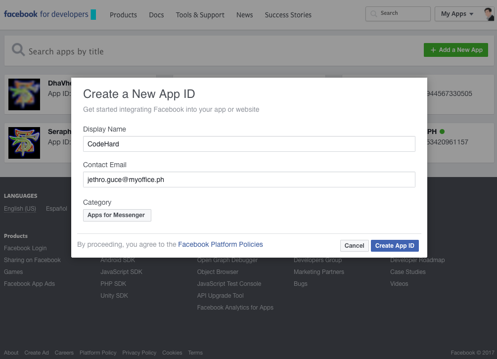
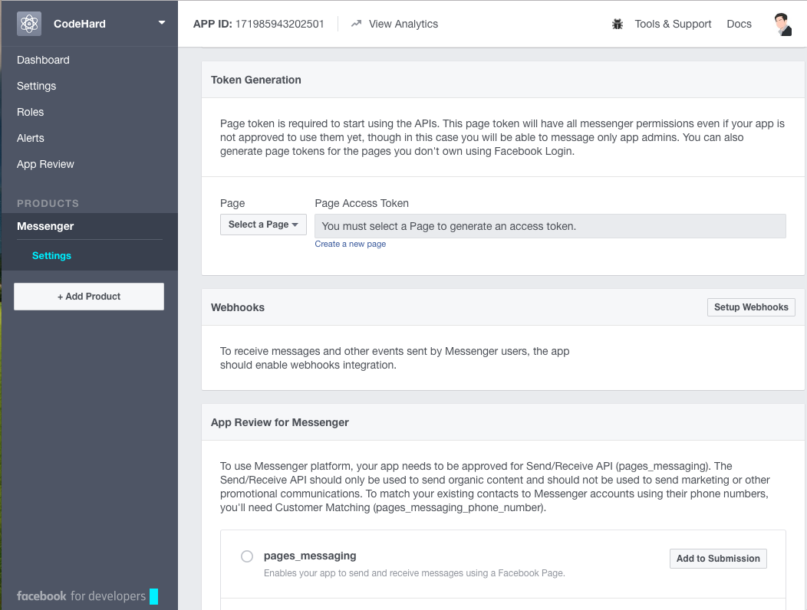
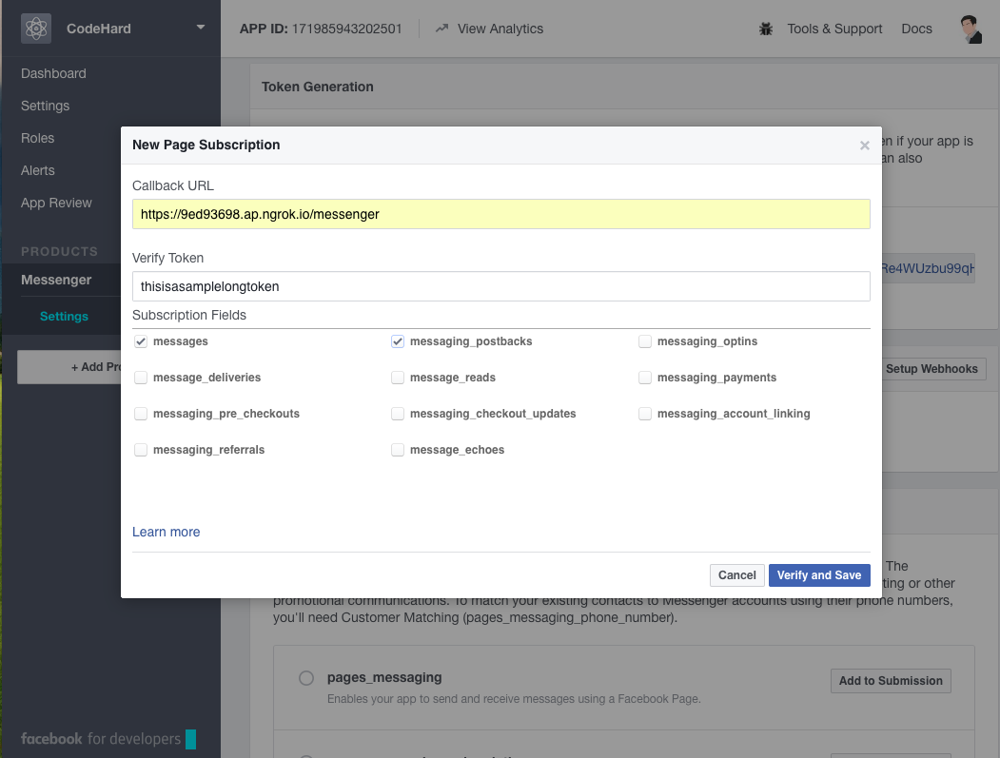

# Table of Contents
1. [Requirements](#requirements)
1. [Setting Up](#setting-up)
1. [Conversations](#conversations)
1. [Developing our Application](#developing-our-application)


## Requirements

### [Facebook App](https://developers.facebook.com/apps/)
The Facebook App contains the settings. This is where you will setup your webhook, retrieve your page access token and submit your app for approval.


### [Facebook Page](https://www.facebook.com/pages/create/)
A Facebook Page will be used as the identity of your bot. When people chat with your bot, they will see the Page name and the Page profile pic.

### Webhook Url
We use secure callbacks in order to send you messaging events. These will be sent to your webhook.
- [ngrok.io](https://ngrok.com/download)
- [Python3](https://www.python.org/downloads/)

## Setting Up
1. Create Facebook Page
1. Create Facebook App

1. Get Page Access Token -> FB_PAGE_TOKEN

1. Set Up WebHooks -> FB_VERIFY_TOKEN

```python
@app.route('/messenger')
def messenger_webhook():
    verify_token = request.args.get('hub.verify_token')
    print(verify_token)
    if verify_token == FB_VERIFY_TOKEN:
        challenge = request.args.get('hub.challenge')
        return challenge
    else:
        return 'Invalid Request or Verification Token'
```
1. Subscribe App to a Page


Once you have completed these steps, you'll be ready to test your integration and receive messages sent to your Page.

To test you're receiving updates via the Webhook, simply send a message to your page. You can do that from your page on facebook.com, the Facebook mobile app, searching your page on Messenger, or using your Messenger short url https://m.me/PAGE_USERNAME.

If you don't receive an update via your Webhook, please ensure you didn't receive any errors when you setup your Webhook and you subscribed your App to your page.

> Developer Note
> When your app is in Development Mode, plugin and API functionality will only work for admins, developers and testers of the app. After your app is approved and public, it will work for the general public.


## Conversations

### Receiving Message
1. Add Support for Post Method
All Callbacks for the Messenger Platfor have a common structure.
```json
{
  "object":"page",
  "entry":[
    {
      "id":"PAGE_ID",
      "time":1458692752478,
      "messaging":[
        {
          "sender":{
            "id":"USER_ID"
          },
          "recipient":{
            "id":"PAGE_ID"
          },

          ...
        }
      ]
    }
  ]
}
```
```python
@app.route('/messenger', methods=['GET', 'POST'])
def messenger_webhook():
    if request.method == 'GET':
        verify_token = request.args.get('hub.verify_token')
        print(verify_token)
        if verify_token == FB_VERIFY_TOKEN:
            challenge = request.args.get('hub.challenge')
            return challenge
        else:
            return 'Invalid Request or Verification Token'
    elif request.method == 'POST':
        data = request.json
        print(data)
        return 'OK'
```


### Sending Message
1. Create function to access fb graph api
```python
def fb_send_message(fb_id, message):
    data = {
        'recipient': {'id': fb_id},
        'message': {'text': message}
    }
    token = 'access_token={}'.format(FB_PAGE_TOKEN)
    url = 'https://graph.facebook.com/v2.6/me/messages?{}'.format(token)
    res = post(url, json=data)

    return res.json()
```


## Developing Our Application